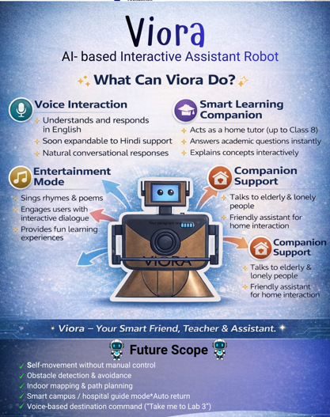

<div align="center">

# 🤖 VIORA

### AI Powered Humanoid Robot



---

### Intelligent • Interactive • Voice Controlled • Face Aware

[]()
[]()
[]()
[]()
[]()


</div>

---

# 📖 About

VIORA is an AI-powered humanoid robot built by combining embedded electronics, computer vision, speech processing, and conversational AI.

The robot can recognize faces, communicate naturally with users, display facial expressions, perform body movements, and respond to voice commands using AI.

The project integrates hardware and software into one intelligent robotic platform.

---

# ✨ Features

- 🎙️ Voice Interaction
- 🤖 AI Conversations using Gemini
- 👤 Face Recognition
- 😊 Facial Expression Display
- 🚶 Motor Movement Control
- 🔊 Audio Playback
- 📺 OLED/TFT Face Display
- 📷 Camera-based Vision
- 📡 Bluetooth Communication
- ⚡ Arduino-based Embedded System

---

# 🛠 Tech Stack

## Hardware

- Arduino UNO
- L298N Motor Driver
- HC-05 Bluetooth Module
- TFT/OLED Display
- Servo Motors
- DC Motors
- Speaker Module
- Battery Pack

---

## Software

- Python
- Arduino IDE
- OpenCV
- Gemini API
- Vosk Speech Recognition
- pyttsx3
- C++
- Embedded C

---

# 📂 Project Structure

```
VIORA
│
├── VIORA_FULLSPEAKING
├── VIORA_SPEAKING
├── VIORA_MOTOR_MOVEMENT
├── VIORA_FACIAL_EXPRESSION
├── trained_face_examples
├── viora_face
├── model.tflite
├── labels.txt
└── README.md
```

---

# ⚙️ Working Modules

## 🎤 Speech Module

- AI conversation
- Speech recognition
- Voice synthesis
- Natural interaction

---

## 👁 Vision Module

- Face Detection
- Face Recognition
- Image Processing
- Camera Integration

---

## 😊 Facial Expression Module

- Eye animations
- Emotional expressions
- OLED/TFT rendering

---

## 🚶 Movement Module

- Motor control
- Direction control
- Gesture movement
- Bluetooth commands

---

# 🧠 AI Capabilities

- Face Recognition
- Voice Recognition
- Conversational AI
- Speech Synthesis
- Intelligent Responses
- Human Interaction

---

# 🚀 Future Improvements

- Object Detection
- Gesture Recognition
- Autonomous Navigation
- Emotion Recognition
- IoT Integration
- Mobile App Control
- Cloud Connectivity

---


# 📦 Installation

Clone the repository

```bash
git clone https://github.com/mishthhiiii/viora.git
```

Open the Arduino project

```
viora_face.ino
```

Install Python dependencies

```bash
pip install opencv-python
pip install vosk
pip install pyttsx3
pip install google-generativeai
```

Run the Python modules and upload the Arduino sketch.

---


# 👩‍💻 Developer

**Mishthi Chaurasia**


</div>
