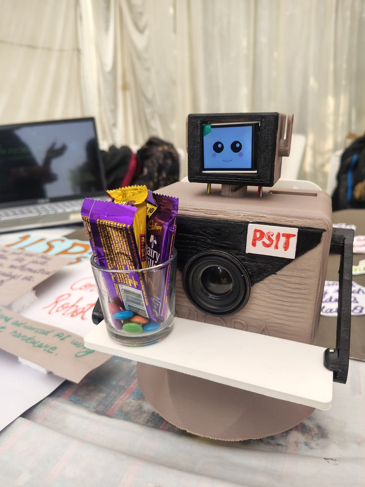
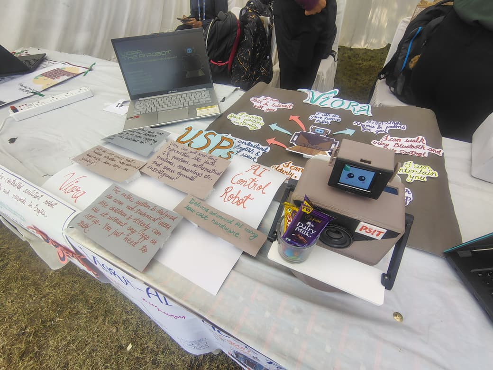
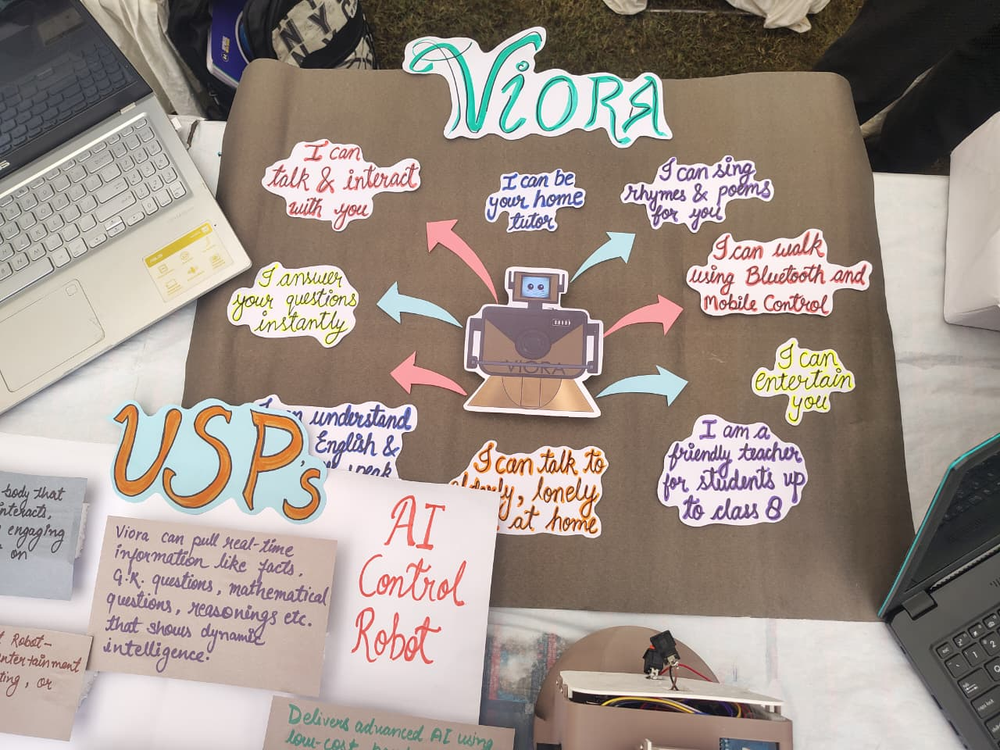
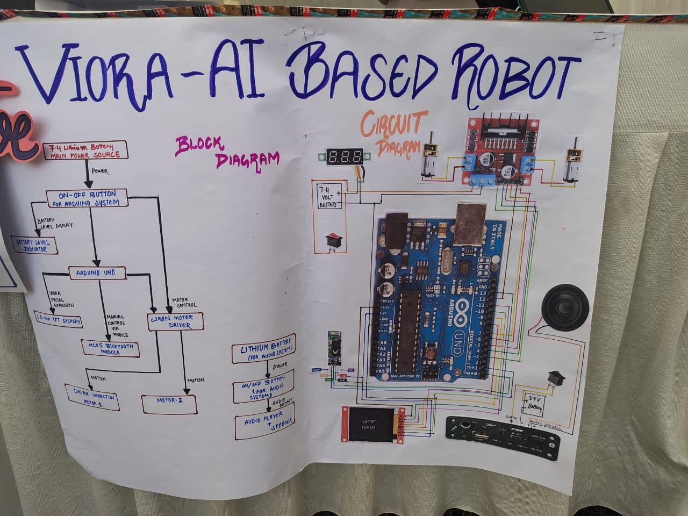
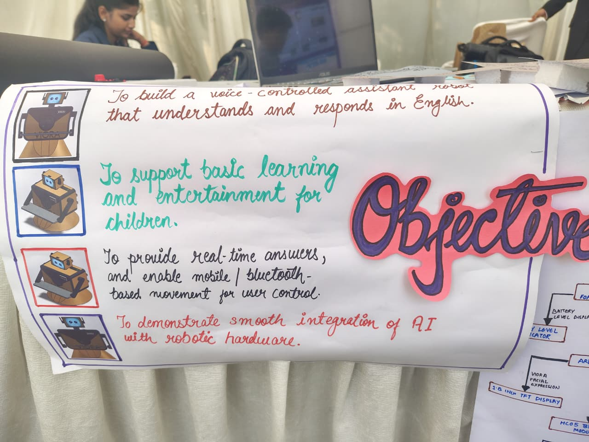
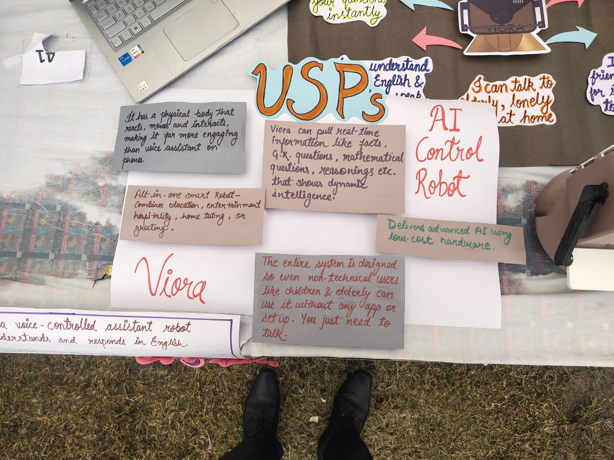

<div align="center">

# 🤖 VIORA

### AI-Powered Humanoid Robot

<p>
An intelligent robotics platform integrating <b>Embedded Systems</b>, <b>Computer Vision</b>, <b>Speech Processing</b>, and <b>Generative AI</b> to deliver an interactive human-robot experience.
</p>



<br>

### Voice • Vision • AI • Robotics • Embedded Systems

<br>


</div>

---

# 📖 Overview

VIORA is an AI-powered humanoid robot that combines embedded electronics, speech processing, computer vision, and generative AI to create an engaging human-robot interaction experience.

The robot supports intelligent voice interaction, animated facial expressions, robotic movement, and AI-powered conversations. A standalone Face Recognition module has been developed separately and can be integrated with the platform.

---

# 📸 Project Gallery

<div align="center">

<table>

<tr>

<td align="center">



<br>

<b>Project Exhibition</b>

</td>

<td align="center">



<br>

<b>Core Capabilities</b>

</td>

</tr>

<tr>

<td align="center">



<br>

<b>Hardware Overview</b>

</td>

<td align="center">



<br>

<b>Project Objectives</b>

</td>

</tr>

<tr>

<td colspan="2" align="center">



<br>

<b>Unique Selling Points</b>

</td>

</tr>

</table>

</div>

---

# 🎥 Demonstration

Experience **VIORA** through demonstrations showcasing its design, hardware integration, AI capabilities, facial expressions, and robotic movement.

<div align="center">

## 📂 Demo Gallery

<a href="https://drive.google.com/drive/folders/1_HhMondo1LDwCDPt9qpbGf3yPqOSQh8z?usp=drive_link">


</a>

</div>

### Included Demonstrations

- 🎬 VIORA Introduction
- 🛠️ Hardware Setup
- 🤖 AI Interaction
- 😊 Facial Expressions
- 🚶 Robot Movement

---

# ✨ Key Features

- 🎙️ AI-powered Voice Interaction
- 🤖 Natural Conversations using Gemini AI
- 😊 Animated Facial Expressions
- 📺 TFT Display Interface
- 🚶 Bluetooth-controlled Robot Movement
- 🔊 Speech Synthesis
- 📷 Camera Integration
- ⚡ Embedded Hardware Control
- 🧠 Intelligent Human-Robot Interaction

---

# 🛠 Tech Stack

## Hardware

- Arduino UNO
- L298N Motor Driver
- HC-05 Bluetooth Module
- TFT Display
- Servo Motors
- DC Motors
- Speaker Module
- Lithium Battery

---

## Software

- Python
- C++
- Embedded C
- Arduino IDE
- OpenCV
- Gemini API
- Vosk
- pyttsx3
- TensorFlow Lite

---
# 🏗️ System Architecture

```text
                    👤 User
                      │
             Voice Commands
                      │
          ┌───────────▼───────────┐
          │   Speech Recognition  │
          │        (Vosk)         │
          └───────────┬───────────┘
                      │
          ┌───────────▼───────────┐
          │      Gemini AI        │
          │ Conversational Engine │
          └───────────┬───────────┘
                      │
      ┌───────────────┼────────────────┐
      │               │                │
      ▼               ▼                ▼
 Face Display     Speaker Output   Arduino UNO
                                      │
                    ┌─────────────────┴─────────────────┐
                    ▼                                   ▼
              Motor Driver                      Bluetooth Module
                    │                                   │
                    ▼                                   ▼
               Robot Movement                  Mobile Control
```

---

# ⚙️ Working Modules

### 🎤 Speech Module

- Voice command recognition
- AI-powered conversations
- Natural speech synthesis

### 👁️ Vision Module

- Face Detection
- Image Processing
- Camera Integration

### 😊 Expression Module

- Animated facial expressions
- TFT display rendering
- Interactive visual feedback

### 🚶 Movement Module

- Bluetooth-controlled navigation
- Motor control
- Robot movement

### 🔊 Audio Module

- AI-generated speech
- Audio playback
- Interactive communication

---

# 🔗 Related Repository

The Face Recognition module is maintained as a separate repository to keep the project modular and independently maintainable. It can be integrated with **VIORA** for real-time face detection and recognition.

**Repository:**  
👉 **[Face Recognition Module](https://github.com/mishthhiiii/face-recognition)**

---

# 📂 Project Structure

```text
VIORA
│
├── media
│   └── images
│
├── trained_face_examples
├── viora_face
├── VIORA_FULLSPEAKING
├── VIORA_SPEAKING
├── VIORA_MOTOR_MOVEMENT
├── VIORA_FACIAL_EXPRESSION
│
├── README.md
└── VIORA_FACE_MOVEMENT_FINAL.ino
```

---

# 📦 Installation

### Clone the repository

```bash
git clone https://github.com/mishthhiiii/viora.git
```

Move to the project directory.

```bash
cd viora
```

### Install Python dependencies

```bash
pip install opencv-python
pip install google-generativeai
pip install vosk
pip install pyttsx3
```

### Upload Arduino Code

Open the following file in the Arduino IDE and upload it to the Arduino Uno:

```text
VIORA_FACE_MOVEMENT_FINAL.ino
```

### Run

Launch the Python modules to enable:

- AI-powered voice interaction
- Speech recognition
- Display animations
- Robot movement

---

<div align="center">


*Made with ❤️ Mishthi Chaurasia*

</div>
